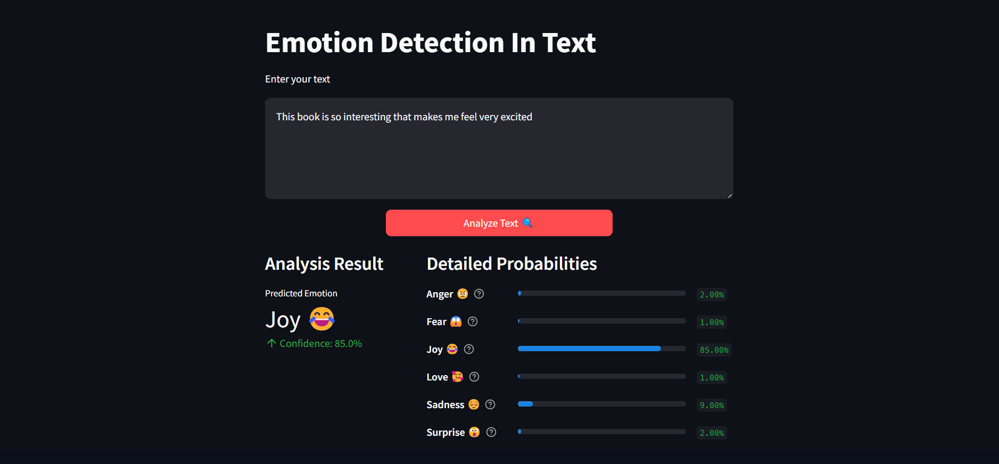

# Detect Emotion In Text

---


---

## Introduction
The Project About Detect Emotion in Text achieves quite high accuracy when used with models Support Vector Machine, Logistic Regotion, Random Forest with Accuracy respectively 91.36%, 91.17%, 89.05% on dair-ai/emotion dataset

## Dataset
The dataset used in the project is the [dair-ai/emotion](https://huggingface.co/datasets/dair-ai/emotion) dataset, which we referenced from Hugging Face. It consists of a total of 436,809 texts in lowercase, with each text labeled with one of six emotions: anger, love, surprise, fear, joy, and sadness. Notably, the labels for sadness and joy are significantly more predominant than the others.

## Project guide
### 1. Installation.
Install all the necessary libraries, use pip to install:
```bash
pip install -r requirements.txt
```

----
### 2. Load model & vectorizer
After running file Emotion_Detection_In_Text.ipynb you will received 3 file: model file, tfidf_transformer file and count_vectorizer generated during the training process in the "models" folder
```bash
run file Emotion_Detection_In_Text.ipynb
```

---
### 3. Test
Open new terminal and then run this line:
```bash
streamlit run app.py
```
---


## Feedback
For feedbacks or issues about project please contact with me: 
```
quangnhatnguyen120@gmail.com
haongoc.nguyen2004@gmail.com
```
